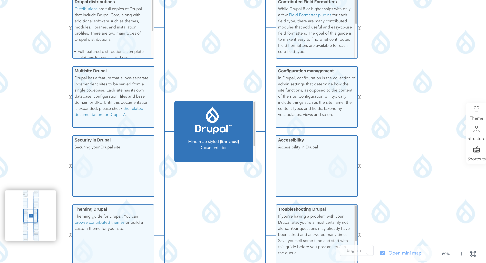

# Drupal [Mind-map](https://drupal.emircanerkul.com) [styled] Documentation

Mind-map styled Enriched Drupal Documentation. All documantation forked with [drupal-to-md](https://github.com/emircanerkul/drupal-to-md) from [Drupal Docs](https://www.drupal.org/docs) on 13 January 2023.

Click [here](https://www.drupal.org/project/mindmap) to visit Drupal Module page.

## Development

* `git clone https://github.com/emircanerkul/drupal-mind-map.git`
* `cd simple-mind-map`
* `npm i`
* `npm link`
* `cd ..`
* `cd web`
* `npm i`
* `npm link simple-mind-map`
* `npm run serve`

## Build

* **For Anywhere**: `npm run build`
* **For Drupal Module**: `npm run dbuild`

## Special Note & Thanks

Special thanks goes [*base project](https://github.com/wanglin2/mind-map) [contributors](https://github.com/wanglin2/mind-map/graphs/contributors) 

This project is rough and has not been thoroughly tested, its features are not
yet fully developed, and there are some performance issues. It is only for
learning and reference purposes and should not be used in actual projects.

The built-in themes and icons in the project come from:

* [Baidu Mind Map](https://naotu.baidu.com/)
* [Zhixi Mind Map](https://www.zhixi.com/)

## License

